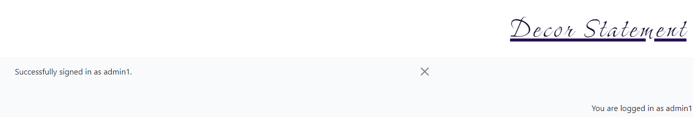

<h1>Decor Statement</h1>

<h2>Introduction</h2>

This is a full-stack framework project built using Django, Python, HTML and CSS. My goal is to create a functioning and responsive website, that allows the admin user to post, and users can create an account and leave a review on the existing posts.

## User Experience Design

Target audience:

Young and middle age adults, mostly couples and women, who are planning on buying a house or renovating their homes. 

This website intends to inspire and give fresh ideas to users. It also wants to become a mean of entertainment bringing new decor trends and useful tips.

- The target audience will expect: 

   -intuitive navigation.  

   -An informative website, with information that is easy-to-find & concise.

   -Ability to review and rate posts.

   -Ability to make a user account in order to interact with the site content

## Admin credentials
- admin: admin1 ,  password: decortest1simple
- normal user: Emily, emily@email.com  password: 1passtest 

## Landing page for first time users

The landing page allows users to see a display with all the posts ordered in chronologically way, being the closest one, the first appearing on the top of the page.

Besides, right at the top the users can see the logo of the page with a sophisticated design, with a navbar  next to it, that contains the main sections of the site: Home, Register and Login. Alonside with the navbar, on the opposte side of the page the user can find the footer with the links to social media platforms and the name of the developer who worked on this project. 

<strong>Landing page for first time users</strong>

<strong>Home page across multiple devices</strong>

 

## Home page (Site Logo)

The first element that the user sees when visiting site, is the logo: Decor Statement in deep, dark purple underlined font. 

- User experience in the Logo section: 

  - The selection of size, colour and type of font, 
 helps the user to identify quickly the name of the site.

  - The name of the site "Decor Statement" indicates clearly that this is a website related with home decor. In addition, the name statement indicates that this web intends to highlight or propose different decor styles. 
  
  - Thanks to the Logo the user would feel captivated with  positive attitude even before checking the rest of the page. 

 <strong>Home page Logo section</strong>

  

## Home page (Posts) 

The Home page focuses mainly on the display of the posts, as we mentioned before the posts appeared ordered in time. The main features that can be highlighted are:

-The first element is a photo with the name of the author under it, just before the title of the post.

- The name of the post is as well a clickable button for the user. 

- Under the post name, the user can read an excerpt and 
 see the date of publication.  

- User experience in the events section: 

  - The selection of size, colour and type of font, 
 helps the user to identify quickly the name of the post and differentiate it from the excerpt.

## Home page (Navbar and foooter) 

Apart from the events, section the Home page also provides the user with a useful navbar and a informative footer. The navbar is divided into three main areas of interest; Home, Register and Login and the footer proportionate information of interest about the developer that worked on this project. The main features that can be highlithed are:

- The clickable sections in both, the navbar and the footer 

- The colour animation when the user hovers over the clickable parts.

- The change in the cursor icon when the user hovers over the clickable parts.

- User experience in the navbar and footer section: 

  - The selection of size, colour and type of font, 
 helps the user to identify quickly the different sections that can be found on the navbar.

  - The colour transition animation in the navbar and the footer, as well as the change in the cursor icon, both give clear indications about the clickable property of the elements in these sections. Besides, they produce an eye-catching effect on the user when these elements are hoovered over, creating the need for clicking and a sense of mystery.

  - The Git hub cat icon in the footer,  gives important visual information about, social media links and the developer. 
  

 

## Posts page (Posts) 
The Posts page focuses mainly on the display of a single post. The main features that can be highlighted are:

-The first element is a photo with the title of the post next to it.

- The content of the post. 

- Under the post there is a section in which the user can check the product its price and the store that sells the product through a clickable button.

- Right after the user can see the section review with its ratings.  If the user is logged in there is also a form on the other side of the page so a review can be created if desired. 

- User experience in the events section: 

  - The selection of size, colour and type of font, 
 helps the user to identify quickly the name of the post and differentiate it from the content.

  - The user can see the hyperlink in blue which links to the item proposed by the post, so that the user does not need to look for it online. 

   - Once the form is filled out the user can see a modal of success or a notification with a error, a user can also checked if the state of the review as if appears on a faded colour and with a messaged if it has not been approved yet. As well te user can update and delete reviews. 
  

  

  

## Authentication

### Registration

A registration page built using the default django user registration form, with a custom view to display feedback messages back to the user  when the form is incorrect.

  

### login

A simple frictionless login page so users can log in quickly, it will feedback to the user if there are errors.

  

## Design Choices

### Fonts 

Grey Qo was chosen as a more interesting font that would give character to the page. It was sourced from [here](https://fonts.google.com/share?selection.family=Grey+Qo|Neuton:ital,wght@0,200;0,300;0,400;0,700;0,800;1,400|Nixie+One)

I selected the font style Nixie One for the titles and Times New Roman for the content of the posts. Times New Roman is a popular font widely used in the world of press, it is clear and elegant.

### Colours

I selected sophisticated and elegant design with a delicate an atemporal palette.This palette has accent tones such as dark purple or slate blue but also brings harmony with french grey and linen.
 [coolors](https://coolors.co/242038-725ac1-8d86c9-cac4ce-f7ece1)

  

### Wire Frames

The wireframes were constructed using Balsamiq.

- Home

  

 - Post Page

  

- Register Page

  

- Login Page

  

 - Logout  Page

  

### Database

I tried to plan out the models before hand to avoid having to do migrations mid-project. I tried to work out the field types, one-to-many, PK or FK etc. 

  

### Models 

  

  

## User Stories, features and bugs

<table>
  <tr>
    <th>User Story</th>
    <th>Features</th>
    <th>Bugs / Issues - tested across viewports of all devices using Google Dev Tools</th>
  </tr>
   <tr>
    <td>As a site user, I can view a paginated list of posts so that I can select which post I want to view.</td>
    <td>Given more than one post in the database, these multiple posts are listed.</td>
    <td>None detected.</td>
   
    
  </tr>
  <tr>
    <td>As a Site User, I can click on a post so that I can read the full text.</td>
    <td>When a blog post title is clicked on a detailed view of the post is seen.</td>
    <td>None detected.</td>
  
  </tr>
   <tr>
    <td>As a Site User / Admin I can view reviews on an individual post so that I can read the conversation</td>
    <td>Given one or more user reviews the admin can view them.
     Then a site user can click on the review thread to read the conversation.</td>
    <td>None detected.</td>
  <tr>
    <td>As a Site User I can register an account so that I can review on a post.</td>
    <td>Given an email a user can register an account. Then the user can log in.When the user is logged in they can review. </td>
    <td>None detected.</td>
  </tr>
  <tr>
    <td>As a Site User I can leave reviews on a post so that I can be involved in the conversation</td>
    <td>When a user review is approved Then a user can reply  Given more than one review then there is a conversation thread</td>
    <td>None detected.</td>
    
  </tr>
  <tr>
    <td>As a Site User I can modify or delete my review on a post so that I can be involved in the conversation</td>
    <td>Given a logged in user, they can modify their review Given a logged in user, they can delete their review</td>
    <td>None detected</td>
    
  </tr>
  <tr>
    <td>As a Site Admin I can create, read, update and delete posts so that I can manage my blog content</td>
    <td>Given a logged in admin, they can create a blog post Given a logged in admin, they can read a blog post
    Given a logged in admin, they can update a blog post
    Given a logged in admin, they can delete a blog post</td>
    <td>None detected</td>
    
  </tr>
  <tr>
    <td>As a Site Admin I can create draft posts so that I can finish writing the content later</td>
    <td>Given a logged in user, they can save a draft blog post
    Then they can finish the content at a later time</td>
    <td>None detected</td>
    
  </tr>
  <tr>
    <td>As a Site Admin I can approve or disapprove reviews so that I can filter out objectionable reviews</td>
    <td>Given a logged in user, they can approve a review
     Given a logged in user, they can disapprove a review</td>
    <td>None detected</td>
    
  </tr>
  <tr>
    <td>As an Admin I can suggest to the user where to buy the product my post is focused on so that I can give them relevant information.</td>
    <td>The user can see the name of the product
     The user can see the price of the product</td>
    <td>None detected</td>
    
  </tr>
   <tr>
    <td>As a user, I can see the store and access the product through the blog site so I don't need to look for the product online.</td>
    <td>The user can see the name of the store where they can buy the product
    The name of the store can give them a link to the actual product</td>
    <td>None detected</td>
    
  </tr>
  <tr>
    <td>As an Admin I can add new decor styles to my database so that my posts can be categorised</td>
    <td>Given a logged in Admin, I can generate new decor styles in the database
    Given a logged in Admin, I can link the decor style generated to a specific post
    Given a logged in Admin, I can organise my posts using the decor style section in the admin panel</td>
    <td>None detected</td>
    
  </tr>
  <tr>
    <td>As a user, I want the site to be visually appealing.</td>
    <td> Select complementary colour scheme.  
    Different elements/features delineated.</td>
    <td>None detected</td>
    
  </tr>
  </table>

 

<table>
  <tr>
    <th>Features</th>
    <th>Image</th>
    <th>Bugs / Issues - tested across viewports of all devices using Google Dev Tools</th>
  </tr>
   <tr>
    <td> Next/previous Button</td>
    <td></td>
    <td>None detected.</td>

  </tr>

  <tr>
    <td> Footer links</td>
    <td></td>
    <td>None detected.</td>

  </tr>

  <tr>
  <td> Navbar links</td>
  <td></td>
  <td>None detected.</td>

  </tr>

  <tr>
  <td> Purchase model link</td>
  <td></td>
  <td>None detected.</td>

  </tr>

  <tr>
  <td> Register Form</td>
  <td></td>
  <td>None detected.</td>

  </tr>

  <tr>
  <td> Login form </td>
  <td></td>
  <td>None detected.</td>

  </tr>

  </tr>

  <tr>
  <td> Login Modal </td>
  <td></td>
  <td>None detected.</td>

  </tr>

  <tr>
  <td> Logout link </td>
  <td></td>
  <td>None detected.</td>

  </tr>

  <tr>
  <td> Review form </td>
  <td></td>
  <td>None detected.</td>

  </tr>

  <tr>
  <td> Review form pending acceptance </td>
  <td></td>
  <td>None detected.</td>

  </tr>

  <tr>
  <td> Review Edit Button </td>
  <td></td>
  <td>None detected.</td>

  </tr>

  <tr>
  <td> Admin Panel </td>
  <td></td>
  <td>None detected.</td>

  </tr>

  <tr>
  <td> Review pending Admin Panel </td>
  <td></td>
  <td>None detected.</td>

  </tr>
  
  <tr>
  <td> Review Editing and summernote Admin Panel </td>
  <td></td>
  <td>None detected.</td>

  </tr>

  <tr>
  <td> Review approved message Admin Panel </td>
  <td></td>
  <td>None detected.</td>

  </tr>

  <tr>
  <td> Approved review delete button and modal </td>
  <td></td>
  <td>None detected.</td>

  </tr>

</table>

 

## Fixed Bugs / Issues
 
<table>
  <tr>
    <th>Bug/Issue</th>
    <th>Resolution</th>
  </tr>
  <tr>
  <td>"Delete button" it was not behaving as expected</td>
    <td>The project needed the static files to be updated "python3 manage.py collectstatic"</td>
  </tr>
  </table>

## Unfixed Bugs / Issues
<table>
  <tr>
    <th>Bug/Issue</th>
    <th>Image</th>
    <th>Resolution</th>
  </tr>
  <tr>
  <td>On smaller devices the "footer" does not extend completely</td>
    <td></td>
    
  <td>Unfortunately I ran out of time to fix this. I would in future sprints change to a fully responsive footer across all the devices, it works well on the rest of devices such as larger phones and tablets.</td>
  </tr>
</table>

### Validator Testing 

For HTML validation https://validator.w3.org/

For CSS validation  https://jigsaw.w3.org/css-validator/

For Light house validation  https://developer.chrome.com/docs/lighthouse/overview/ 

## Deployment

Site successfully deployed on [heroku](https://blogdecor1-242e1f9b3655.herokuapp.com/)

## Credits 

[Coolors](https://coolors.co/012765-d30cd5-003fa5-010100-f8fff4) was used for colour pallette

[Bootstrap](https://getbootstrap.com/)

[fontawesome](https://fontawesome.com/)

[Code Institute](https://codeinstitute.net/ie/) - 'I think therefore I blog' project helped me with recipe details page and pagination

[Django documentation](https://docs.djangoproject.com/en/4.0/topics/pagination/) - also helped me with pagination and other problems

## Languages 
- [HTML5](https://en.wikipedia.org/wiki/HTML5)
- [CSS3](https://en.wikipedia.org/wiki/CSS)
- [Python](https://www.python.org/)

## Media 
All images were taken from [Pixabay](https://pixabay.com/)

### Content 

For validation in HTML https://validator.w3.org/

For validation in CSS https://jigsaw.w3.org/css-validator/

Wireframes produced using [Balsamiq](https://balsamiq.com/)

### Acknowledgements

Thanks to my mentor Spencer for his help on how to upload images and his guidance for the models design. 

Thanks to my colleague Tom for his help, debugging my site on the very last moment when two brains think better than one.

